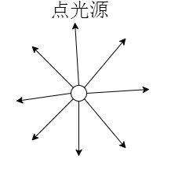
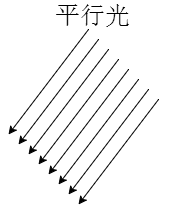

## 1.场景对象: 

```javascript
var scene = new THREE.Scene();
```

## 2. 光源:

1. **环境光**:

   - 环境光是没有特定方向的光源，主要是均匀整体改变Threejs物体表面的明暗效果，这一点和具有方向的光源不同，比如点光源可以让物体表面不同区域明暗程度不同。

   - ```javascript
     //环境光:环境光颜色RGB成分分别和物体材质颜色RGB成分分别相乘
     var ambient = new THREE.AmbientLight(0x444444);
     scene.add(ambient);//环境光对象添加到scene场景中
     ```

     

2. **点光源**:

   - 点光源就像生活中的白炽灯

   - 点光源需要设置位置属性`.position`，光源位置不同，物体表面被照亮的面不同，远近不同因为衰减明暗程度不同

   - ```javascript
     //点光源
     var point = new THREE.PointLight(0xffffff);
     //设置点光源位置，改变光源的位置
     point.position.set(400, 200, 300);
     scene.add(point);
     ```


3. **平行光: **
   - 对于一个平面而言，平面不同区域接收到平行光的入射角一样。
   - 位置`.position`和目标`.target`两个属性来一起确定平行光方向
   - 目标`.target`的属性值可以是Threejs场景中任何一个三维模型对象，比如一个网格模型`Mesh`
   - 

